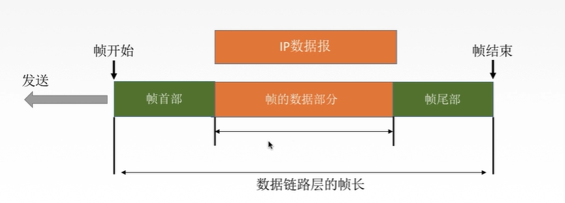

>1.概念  
-----------------
   * 网络层负责给数据链路层下达任务，然后交由物理层执行

<!--truncate-->

>2.主要功能  
--------------
   * 封装成帧: 数据链路层将发送的文件编号封装一下。封装的网络数据包在链路层叫做<u>数据帧</u>。 
   * 透明传输: 指不管网络层下达任何信息，数据链路层都要传输。帧得数据部分可能有跟帧首部完全一样得字符，采取一些措施让接受方不被误导，能让接受方分辨帧得首部和帧得数据。
   * 差错控制: 差错控制是在物理层信息给到数据链路层是否完整传输，没有就重新发送。
   * 差错纠正: 差错纠正是链路层知道多个顺序排列文件，丢失的具体文件是什么，并且通过重新发送没有的文件来纠正。
   * 流量控制: 例：发送方发送的速度快，接收方接收速度慢，会造成传输出错。
      <u>注意：传输层TCP也有流量控制功能，区别在于TCP是端到端的流量控制，链路层是点到点。</u>
      流量控制的方法：<u>滑动窗口协议、选择重协议</u>

整理至 [掘金 lio-mengxiangl](https://juejin.im/post/5e51febde51d4526c932b390)
