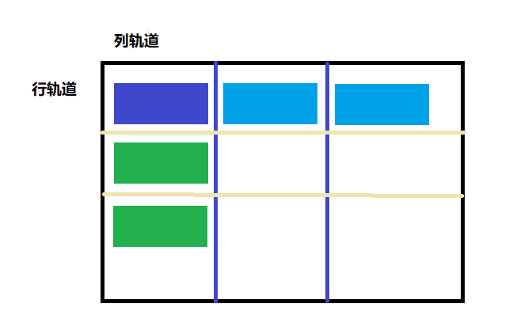

<!--truncate-->
> Grid布局
    Grid布局是二维布局方式，可以同时控制行和列的排布和对齐方式，由水平线和垂直线构成。

```   
    .grid{
        height: 100%;
        width: 100%;
        display: grid;
        /* 多列布局 有几列写几列   可以是固定宽度  也可以是浮动宽度fr  fr是grid布局专用单位，代表grid剩余空间*/
        grid-template-columns: 1fr 1fr ; 
        /* 列间距 */
        /* column-gap: 10px; */
        /* 行间距 */
        /* row-gap: 10px; */
        /* 统一设置 */
        gap: 20px;
    }
    .grid div{
        background: skyblue;
        /* margin: 20px; */
        text-align: center;
        border-radius: 10px;
    }
    <div class="grid">
        <div class="item1">item1</div>
        <div class="item2">item2</div>
        <div class="item3">item3</div>
        <div class="item4">item4</div>
    </div>
```    
* 使用grid-template-areas快速实现layout布局
```
.layout{
        height: 100%;
        width: 100%;
        display: grid;
        gap: 10px;
        /* 多行布局 */
        grid-template-rows: 1fr 6fr 1fr ;
        /* 排列元素   指定区域排列 将页面分成4列*/
        grid-template-areas: "header header header header""sidebar content content content" "footer footer footer footer";
    }
    header{
        /* 指定对应区域 */
        grid-area: header;
        background-color: seagreen;
    }
    aside{
        /* 指定对应区域 */
        grid-area: sidebar;
        background: greenyellow;
    }
    main{
        /* 指定对应区域 */
        grid-area: content;
        background-color: skyblue;
    }
    footer{
        /* 指定对应区域 */
        grid-area: footer;
        background-color: sandybrown;
    }
<div class="layout">
        <header>头部</header>
        <aside>侧边栏</aside>
        <main>内容</main>
        <footer>底部</footer>
    </div>
```
* gird对齐方式 
    与flex类似有水平方向行轴，垂直方向的块轴
    ```
    /* 对齐方式 */
    .grid{
        /* 垂直方向 */
        align-items: center;/* center 居中对齐 end靠下对齐*/
        /* 水平方向 */
        justify-items: center;/*  center 居中对齐 end靠右对齐 space-between 两端对齐 */
        /* 轨道尺寸小于grid容器 轨道对齐 */
        align-content: center; /* center 居中对齐 end靠下对齐 */
        /* 水平方向 */
        justify-content: center;/*  center 居中对齐 end靠右对齐 space-between 两端对齐 */
    }
    ```